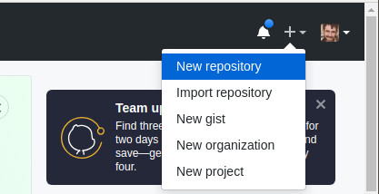
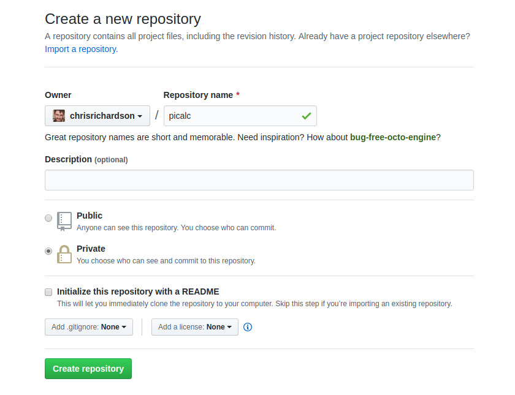
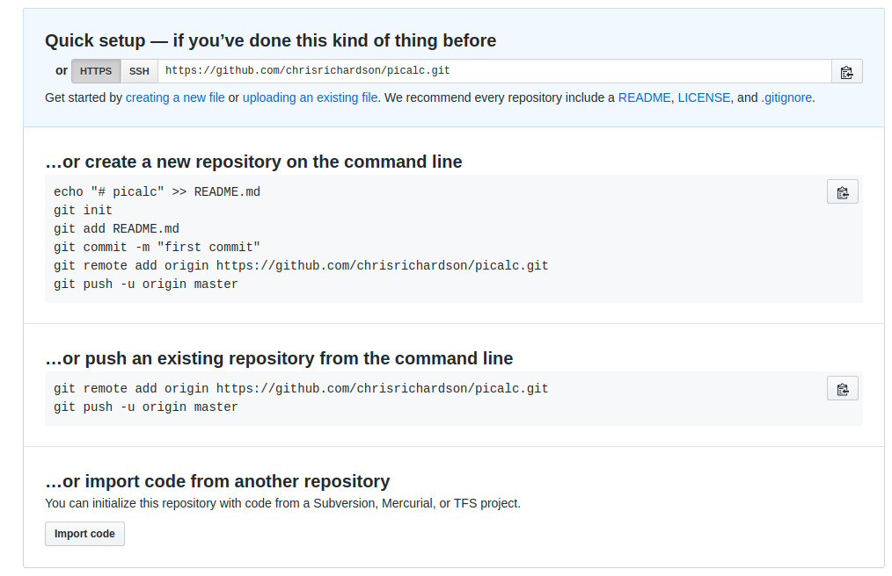
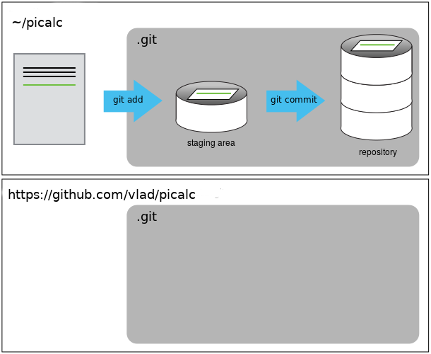

Version control really comes into its own when we begin to collaborate with
other people.  We already have most of the machinery we need to do this; the
only thing missing is to copy changes from one repository to another.

Systems like Git allow us to move work between any two repositories.  In
practice, though, it's easiest to use one copy as a central hub, and to keep it
on the web rather than on someone's laptop.  Most programmers use hosting
services like [GitHub](http://github.com), [BitBucket](http://bitbucket.org) or
[GitLab](http://gitlab.com/) to hold those master copies; we'll explore the pros and cons of this in the final section of this lesson.

Let's start by creating an account at GitHub. The University of Cambridge recently signed up to "GitHub Education", which
gives some additional benefits for staff and students, but we will not be using any of those features.
Go to [GitHub](https://github.com) and create a login, if you don't have one already. You will need to confirm your email address.
Once you have an account, you should be able to create a new repository online. Click on the "+" sign in the top right corner.

This time, I'm calling the repository "picalc", as it will include
some code to calculate the value of "pi". Let's make it a "Private"
repository for now. The other options can stay as default.

This effectively does the following on GitHub's servers:

~~~
$ mkdir picalc
$ cd picalc
$ git init
~~~
{: .bash}

Helpfully, GitHub tells you what to do to start a new repository. The first few lines cover what we have already done.
You will notice some new commands `git remote` and `git push` which we will cover in this section.

Let's follow some of their suggestions and create some files to put in a new repository. Go back to your home directory and make a new folder:

~~~
cd ~
mkdir picalc
cd picalc
git init
nano pi.py
~~~
{: .bash}

In the file, let's put a simple code to calculate an approximate value for "pi" - NB this is not a serious method, it is very slow!

~~~
a = 2.0
for n in range(1, 10000):
    a = a * (n*n)/(n*n - 0.25)
print(a)
~~~

Try it by running `python pi.py`. It should print out `3.14151411083`.

~~~
git add pi.py
git commit -m "Code to calculate pi"
~~~

Our local repository contains `pi.py`, but the
remote repository on GitHub doesn't contain any files yet.

The next step is to connect the two repositories.  We do this by making the
GitHub repository a [remote]({{ page.root }}/reference/#remote) for the local repository.

We will change the authentication from SSH to HTTPS, as it is easier to work with for
now. Use a pattern like this (replacing vlad with your github
username) - this should be the same command which GitHub suggests when
creating the repository.

~~~
git remote add origin https://vlad@github.com/vlad/picalc.git
~~~
{: .bash}

Make sure to use the URL for your repository rather than Vlad's: the only
difference should be your username instead of `vlad`.

> ## HTTPS vs. SSH
>
> We use HTTPS here because it does not require additional configuration.
> You may want to set up SSH access, which is a bit more secure, and
> does not require a password every time.
> Follow one of the great tutorials from
> [github](https://help.github.com/articles/generating-ssh-keys),
> [Atlassian/BitBucket](https://confluence.atlassian.com/display/BITBUCKET/Set+up+SSH+for+Git)
> and [GitLab](https://about.gitlab.com/2014/03/04/add-ssh-key-screencast/)
> (this one has a screencast).
>
> If you are feeling confident, it can be done with the following command: `ssh-keygen`.
> You then need to upload the file `~/.ssh/id_rsa.pub` into your "SSH and GPG settings"
> on GitHub.
{: .callout}

We can check that the command has worked by running `git remote -v`:

~~~
$ git remote -v
~~~
{: .bash}

~~~
origin   https://vlad@github.com/vlad/picalc.git (push)
origin   https://vlad@github.com/vlad/picalc.git (fetch)
~~~
{: .output}

The name `origin` is a local nickname for your remote repository: we could use
something else if we wanted to, but `origin` is the default.

Once the nickname `origin` is set up, this command will push the changes from
our local repository to the repository on GitHub:

~~~
$ git push -u origin master
~~~
{: .bash}

By adding the "-u" option we connect the "upstream" tag "origin" with
the repository so you don't have to always specify "origin" every time you
do "git push". It is now the default.

~~~
Counting objects: 9, done.
Delta compression using up to 4 threads.
Compressing objects: 100% (6/6), done.
Writing objects: 100% (9/9), 821 bytes, done.
Total 9 (delta 2), reused 0 (delta 0)
To https://github.com/vlad/picalc
 * [new branch]      master -> master
Branch master set up to track remote branch master from origin.
~~~
{: .output}

> ## Password Managers
>
> If your operating system has a password manager configured, `git push` will
> try to use it when it needs your username and password.  For example, this
> is the default behavior for Git Bash on Windows. If you want to type your
> username and password at the terminal instead of using a password manager,
> type:
>
> ~~~
> $ unset SSH_ASKPASS
> ~~~
> {: .bash}
>
> in the terminal, before you run `git push`.  Despite the name, [git uses
> `SSH_ASKPASS` for all credential
> entry](http://git-scm.com/docs/gitcredentials#_requesting_credentials), so
> you may want to unset `SSH_ASKPASS` whether you are using git via SSH or
> https.
>
> You may also want to add `unset SSH_ASKPASS` at the end of your `~/.bashrc`
> to make git default to using the terminal for usernames and passwords.
{: .callout}

Our local and remote repositories are now in this state:

We can pull changes from the remote repository to the local one as well:

~~~
$ git pull origin master
~~~
{: .bash}

~~~
From https://github.com/vlad/picalc
 * branch            master     -> FETCH_HEAD
Already up-to-date.
~~~
{: .output}

Pulling has no effect in this case because the two repositories are already
synchronized.  If someone else had pushed some changes to the repository on
GitHub, though, this command would download them to our local repository.

## GitHub GUI

Browse to your `picalc` repository on GitHub.

* Try clicking on the 'Code' tab at top left. You can use this to
   browse all the files in your repository. There are a lot of other
   advanced tabs, but you probably just want to stick to "Code" for now.

 * Now look at the 'Commits' button (it probably just says "1 commit"
   and a clockface). This shows a graphical representation of what you
   would see with `git log`. The git commit hashes are shown, and
   if you click on one, it will give you the `git diff` between the
   two neighbouring versions.

> ## Push vs. Commit
>
> In this lesson, we introduced the "git push" command.
> How is "git push" different from "git commit"?
{: .challenge}

### Adding more commits
Let's add some more commits to the repository. Edit `picalc.py` and
add some more lines, e.g. change it to:

~~~
a = 2.0
nmax = 100000
for n in range(1, nmax):
    a = a * (n*n)/(n*n - 0.25)
print(a)
~~~

~~~
git add picalc.py
git commit -m "Set nmax parameter"
git push
~~~
{: .bash}

Now take a look at the web interface again, and see your new
commit. Spend a bit of time exploring the web interface.

> ## Fixing Remote Settings
>
> It happens quite often in practice that you made a typo in the
> remote URL. This exercise is about how to fix this kind of issue.
> First start by adding a remote with an invalid URL:
>
> ~~~
> git remote add broken https://github.org/this/url/is/invalid
> ~~~
> {: .bash}
>
> Do you get an error when adding the remote? Can you think of a
> command that would make it obvious that your remote URL was not
> valid?
>
> ~~~
> git push broken master
> ~~~
>
> Can you figure out how to fix the URL (tip: use `git remote
> -h`)? Don't forget to clean up and remove this remote once you are
> done with this exercise.
{: .challenge}

> ## GitHub README file
>
> In this section we learned about creating a remote repository on
> GitHub. The 'Overview' tab suggests you create a README.
> Try doing that by clicking on the "Create a README" button. What
> effect will this have on your repository?
{: .challenge}
