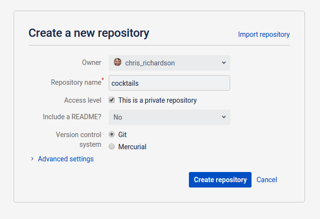
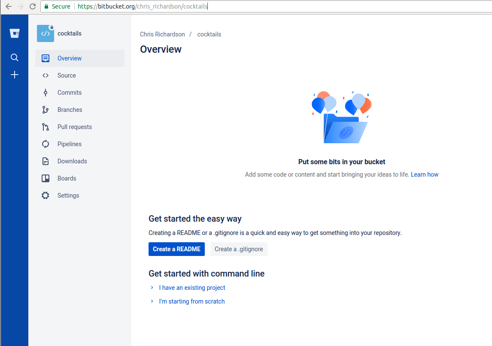
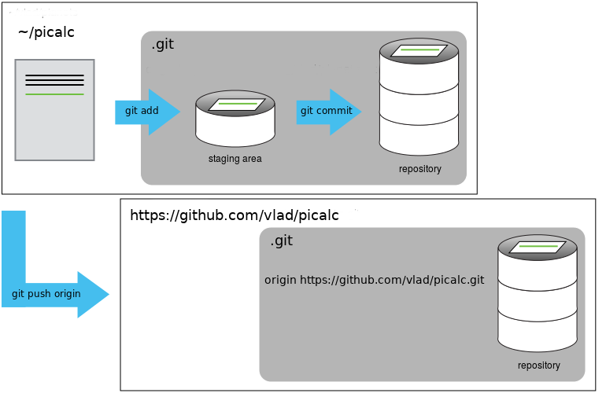

Version control really comes into its own when we begin to collaborate with
other people.  We already have most of the machinery we need to do this; the
only thing missing is to copy changes from one repository to another.

Systems like Git allow us to move work between any two repositories.  In
practice, though, it's easiest to use one copy as a central hub, and to keep it
on the web rather than on someone's laptop.  Most programmers use hosting
services like [GitHub](http://github.com), [BitBucket](http://bitbucket.org) or
[GitLab](http://gitlab.com/) to hold those master copies; we'll explore the pros and cons of this in the final section of this lesson.

Let's start by sharing the changes we've made to our current project
with the world. Create an account on [bitbucket.org](https://bitbucket.org). Bitbucket have an academic programme, which
allows you to have unlimited private repositories (unlike some other
websites). If you use an `.ac.uk` email address to sign up, you will
automatically get this feature.

Log in to Bitbucket, then click on the menu drop-down "Repositories" and
create a new repository called `planets`:

This effectively does the following on Bitbucket's servers:

~~~
$ mkdir planets
$ cd planets
$ git init
~~~
{: .bash}

Our local repository still contains our earlier work on `mars.txt`, but the
remote repository on bitbucket doesn't contain any files yet.

The next step is to connect the two repositories.  We do this by making the
bitbucket repository a [remote]({{ page.root }}/reference/#remote) for the local repository.

As soon as the repository is created, bitbucket displays a page with a
URL and some information on how to configure your local repository.

We have an existing repository, so click on the "I have an existing
project" link. It will give you some instructions for linking up your
repository to the website. However, we will change the
authentication from SSH to HTTPS, as it is easier to work with for
now. Use a pattern like this (replacing vlad with your bitbucket username).

~~~
git remote add origin https://vlad@bitbucket.org/vlad/planets.git
~~~
{: .bash}

Make sure to use the URL for your repository rather than Vlad's: the only
difference should be your username instead of `vlad`.

> ## HTTPS vs. SSH
>
> We use HTTPS here because it does not require additional configuration.  After
> the workshop you may want to set up SSH access, which is a bit more secure, by
> following one of the great tutorials from
> [github](https://help.github.com/articles/generating-ssh-keys),
> [Atlassian/BitBucket](https://confluence.atlassian.com/display/BITBUCKET/Set+up+SSH+for+Git)
> and [GitLab](https://about.gitlab.com/2014/03/04/add-ssh-key-screencast/)
> (this one has a screencast).
{: .callout}

We can check that the command has worked by running `git remote -v`:

~~~
$ git remote -v
~~~
{: .bash}

~~~
origin   https://bitbucket.org/vlad/planets.git (push)
origin   https://bitbucket.org/vlad/planets.git (fetch)
~~~
{: .output}

The name `origin` is a local nickname for your remote repository: we could use
something else if we wanted to, but `origin` is the default.

Once the nickname `origin` is set up, this command will push the changes from
our local repository to the repository on bitbucket:

~~~
$ git push -u origin master
~~~
{: .bash}

By adding the "-u" option we connect the "upstream" tag "origin" with
the repository so you don't have to always specify "origin" every time you
do "git push". It is now the default.

~~~
Counting objects: 9, done.
Delta compression using up to 4 threads.
Compressing objects: 100% (6/6), done.
Writing objects: 100% (9/9), 821 bytes, done.
Total 9 (delta 2), reused 0 (delta 0)
To https://bitbucket.org/vlad/planets
 * [new branch]      master -> master
Branch master set up to track remote branch master from origin.
~~~
{: .output}

> ## Password Managers
>
> If your operating system has a password manager configured, `git push` will
> try to use it when it needs your username and password.  For example, this
> is the default behavior for Git Bash on Windows. If you want to type your
> username and password at the terminal instead of using a password manager,
> type:
>
> ~~~
> $ unset SSH_ASKPASS
> ~~~
> {: .bash}
>
> in the terminal, before you run `git push`.  Despite the name, [git uses
> `SSH_ASKPASS` for all credential
> entry](http://git-scm.com/docs/gitcredentials#_requesting_credentials), so
> you may want to unset `SSH_ASKPASS` whether you are using git via SSH or
> https.
>
> You may also want to add `unset SSH_ASKPASS` at the end of your `~/.bashrc`
> to make git default to using the terminal for usernames and passwords.
{: .callout}

Our local and remote repositories are now in this state:

We can pull changes from the remote repository to the local one as well:

~~~
$ git pull origin master
~~~
{: .bash}

~~~
From https://bitbucket.org/vlad/planets
 * branch            master     -> FETCH_HEAD
Already up-to-date.
~~~
{: .output}

Pulling has no effect in this case because the two repositories are already
synchronized.  If someone else had pushed some changes to the repository on
bitbucket, though, this command would download them to our local repository.

## bitbucket GUI

Browse to your `planets` repository on bitbucket.
 * Try clicking on the 'Source' button on the left. You can use this to
   browse all the files in your repository. By using the dropdown menu
   with the git hash (e.g. d69e7a9) you can choose which version of the
   file to view.
 * Now look at the 'Commits' button. This shows a graphical
   representation of what you would see with `git log`. Again the git
   commit hashes are shown, and if you click on one, it will give you
   the `git diff` between the two neighbouring versions.

> ## Push vs. Commit
>
> In this lesson, we introduced the "git push" command.
> How is "git push" different from "git commit"?
{: .challenge}

> ## Fixing Remote Settings
>
> It happens quite often in practice that you made a typo in the
> remote URL. This exercise is about how to fix this kind of issue.
> First start by adding a remote with an invalid URL:
>
> ~~~
> git remote add broken https://github.com/this/url/is/invalid
> ~~~
> {: .bash}
>
> Do you get an error when adding the remote? Can you think of a
> command that would make it obvious that your remote URL was not
> valid?
> ~~~
> git push broken master
> ~~~
Can you figure out how to fix the URL (tip: use `git remote
> -h`)? Don't forget to clean up and remove this remote once you are
> done with this exercise.
{: .challenge}

> ## bitbucket README file
>
> In this section we learned about creating a remote repository on
> bitbucket. The 'Overview' tab suggests you create a README.
> Try doing that by clicking on the "Create a README" button. What
> effect will this have on your repository?
{: .challenge}
