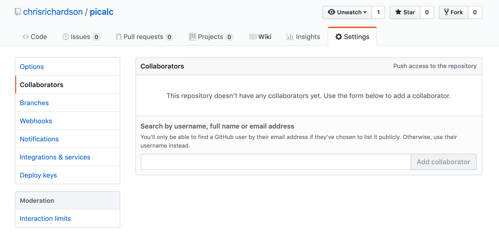
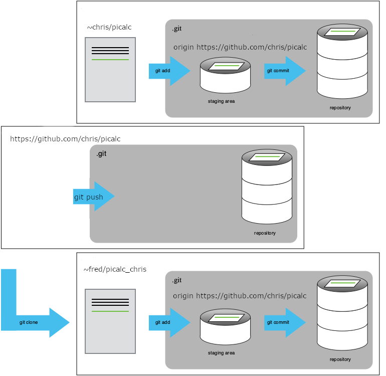

For the next step, get into pairs.  One person will be the "Owner" and the other
will be the "Collaborator". The goal is that the Collaborator add changes into
the Owner's repository. We will switch roles at the end, so both persons will
play Owner and Collaborator.

> ## Practicing By Yourself
>
> If you're working through this lesson on your own, you can carry on by opening
> a second terminal window.
> This window will represent your partner, working on another computer. You
> won't need to give anyone access on GitHub, because both 'partners' are you.
{: .callout}

The Owner needs to give the Collaborator access. On GitHub, click
the settings (gear) button on the right, then select "Collaborators",
and enter your partner's username or email, and give them
"Write access". Click Add. The Collaborator should receive an email
notifying them they have access.

Next, the Collaborator needs to download a copy of the Owner's
repository to their  machine. This is called "cloning a repo". To
clone the Owner's repo into their own folder, the Collaborator enters:

~~~
$ git clone https://github.org/chris/picalc.git picalc_chris
~~~
{: .bash}

Replace 'chris' with the Owner's username. Note that we have specified
the folder name as `~/Desktop/picalc_chris` instead of accepting the
default of `picalc`. This can be useful to `git clone` repositories to
folders of your choice.

As Collaborator, you can now make a change in your clone of the
Owner's repository, in exactly the same way as we've been doing before:

~~~
$ cd ~/Desktop/picalc_chris
$ gedit pi.py
$ cat pi.py
~~~
{: .bash}

~~~
# Add a comment line by collaborator
a = 2.0
nmax = 100000
for n in range(1, nmax):
    a = a * (n*n)/(n*n - 0.25)
print(a)
~~~
{: .output}

~~~
$ git add pi.py
$ git commit -m "Add a comment line"
~~~
{: .bash}

~~~
 1 file changed, 1 insertion(+)
 create mode 100644 pi.py
~~~
{: .output}

Then push the change to the *Owner's repository* on GitHub:

~~~
$ git push
~~~
{: .bash}

~~~
Counting objects: 4, done.
Delta compression using up to 4 threads.
Compressing objects: 100% (2/2), done.
Writing objects: 100% (3/3), 306 bytes, done.
Total 3 (delta 0), reused 0 (delta 0)
To https://github.com/chris/picalc.git
   9272da5..29aba7c  master -> master
~~~
{: .output}

Note that we didn't have to create a remote called `origin`: Git uses this
name by default when we clone a repository.  (This is why `origin` was a
sensible choice earlier when we were setting up remotes by hand.)

Take a look to the Owner's repository on its GitHub website now (maybe you need
to refresh your browser.) You should be able to see the new commit made by the
Collaborator.

To download the Collaborator's changes from GitHub, the Owner now enters:

~~~
$ git pull
~~~
{: .bash}

~~~
remote: Counting objects: 4, done.
remote: Compressing objects: 100% (2/2), done.
remote: Total 3 (delta 0), reused 3 (delta 0)
Unpacking objects: 100% (3/3), done.
From https://github.org/chris/picalc
 * branch            master     -> FETCH_HEAD
Updating 9272da5..29aba7c
Fast-forward
 pi.py | 1 +
 1 file changed, 1 insertion(+)
~~~
{: .output}

Now the three repositories (Owner's local, Collaborator's local, and Owner's on
GitHub) are back in sync.

> ## A Basic Collaborative Workflow
>
> In practice, it is good to be sure that you have an updated version of the
> repository you are collaborating on, so you should always `git pull` before making
> changes. The basic collaborative workflow would be:
>
> * update your local repo with `git pull`,
> * make your changes and stage them with `git add`,
> * commit your changes with `git commit -m`, and
> * upload the changes to GitHub with `git push`
>
> It is better to make many commits with smaller changes rather than
> of one commit with massive changes: small commits are easier to
> read and review.
{: .callout}

> ## Switch Roles and Repeat
>
> Switch roles and repeat the whole process.
{: .challenge}

> ## Review Changes
>
> The Owner push commits to the repository without giving any information
> to the Collaborator. How can the Collaborator find out what has changed with
> command line? And online with GitHub?
{: .challenge}
