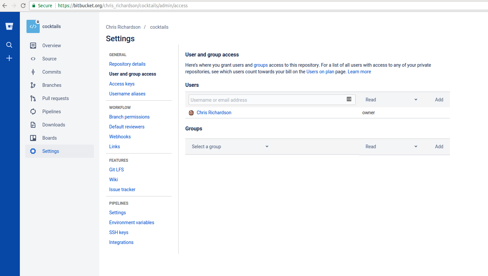

For the next step, get into pairs.  One person will be the "Owner" and the other
will be the "Collaborator". The goal is that the Collaborator add changes into
the Owner's repository. We will switch roles at the end, so both persons will
play Owner and Collaborator.

> ## Practicing By Yourself
>
> If you're working through this lesson on your own, you can carry on by opening
> a second terminal window.
> This window will represent your partner, working on another computer. You
> won't need to give anyone access on bitbucket, because both 'partners' are you.
{: .callout}

The Owner needs to give the Collaborator access. On Bitbucket, click
the settings (gear) button on the left, then select "User and group
access", and enter your partner's username or email, and give them
"Write access". Click Add. The Collaborator should receive an email
notifying them they have access.

Next, the Collaborator needs to download a copy of the Owner's
repository to their  machine. This is called "cloning a repo". To
clone the Owner's repo into their own folder, the Collaborator enters:

~~~
$ git clone https://bitbucket.org/vlad/cocktails.git vlad-cocktails
~~~
{: .bash}

Replace 'vlad' with the Owner's username. Note that we have specified
the folder name as `~/Desktop/vlad-cocktails` instead of accepting the
default of `cocktails`. This can be useful to `git clone` repositories to
folders of your choice.

As Collaborator, you can now make a change in your clone of the
Owner's repository, in exactly the same way as we've been doing before:

~~~
$ cd ~/Desktop/vlad-cocktails
$ nano screwdriver.md
$ cat screwdriver.md
~~~
{: .bash}

~~~
# Screwdriver cocktail
~~~
{: .output}

~~~
$ git add screwdriver.md
$ git commit -m "Header line for new cocktail"
~~~
{: .bash}

~~~
 1 file changed, 1 insertion(+)
 create mode 100644 screwdriver.md
~~~
{: .output}

Then push the change to the *Owner's repository* on bitbucket:

~~~
$ git push origin master
~~~
{: .bash}

~~~
Counting objects: 4, done.
Delta compression using up to 4 threads.
Compressing objects: 100% (2/2), done.
Writing objects: 100% (3/3), 306 bytes, done.
Total 3 (delta 0), reused 0 (delta 0)
To https://bitbucket.org/vlad/cocktails.git
   9272da5..29aba7c  master -> master
~~~
{: .output}

Note that we didn't have to create a remote called `origin`: Git uses this
name by default when we clone a repository.  (This is why `origin` was a
sensible choice earlier when we were setting up remotes by hand.)

Take a look to the Owner's repository on its bitbucket website now (maybe you need
to refresh your browser.) You should be able to see the new commit made by the
Collaborator.

To download the Collaborator's changes from bitbucket, the Owner now enters:

~~~
$ git pull origin master
~~~
{: .bash}

~~~
remote: Counting objects: 4, done.
remote: Compressing objects: 100% (2/2), done.
remote: Total 3 (delta 0), reused 3 (delta 0)
Unpacking objects: 100% (3/3), done.
From https://bitbucket.org/vlad/cocktails
 * branch            master     -> FETCH_HEAD
Updating 9272da5..29aba7c
Fast-forward
 screwdriver.md | 1 +
 1 file changed, 1 insertion(+)
 create mode 100644 screwdriver.md
~~~
{: .output}

Now the three repositories (Owner's local, Collaborator's local, and Owner's on
bitbucket) are back in sync.

> ## A Basic Collaborative Workflow
>
> In practice, it is good to be sure that you have an updated version of the
> repository you are collaborating on, so you should always `git pull` before making
> changes. The basic collaborative workflow would be:
>
> * update your local repo with `git pull origin master`,
> * make your changes and stage them with `git add`,
> * commit your changes with `git commit -m`, and
> * upload the changes to bitbucket with `git push origin master`
>
> It is better to make many commits with smaller changes rather than
> of one commit with massive changes: small commits are easier to
> read and review.
{: .callout}

> ## Let's all work together now
>
> I have an empty-ish repository at [https://bitbucket.org/chris_richardson/cocktails](https://bitbucket.org/chris_richardson/cocktails).
> If you give me your userids, I will give you access.
>
> * Clone the repository (`git clone https://bitbucket.org/chris_richardson/cocktails ChrisR-cocktails`) into the folder `ChrisR-cocktails`.
> * Add a new cocktail file (`nano cocktail_name.md`)
> * With git, add the file, commit, and push to origin master.
> * you may have to do `git pull` if it has changed whilst you were editing...
{: .callout}

> ## Switch Roles and Repeat
>
> Switch roles and repeat the whole process.
{: .challenge}

> ## Review Changes
>
> The Owner push commits to the repository without giving any information
> to the Collaborator. How can the Collaborator find out what has changed with
> command line? And online with bitbucket?
{: .challenge}

> ## Other features in bitbucket website
>
> You will have noticed a lot of other buttons on the left side in bitbucket.
> "Overview", "Source" and "Commits" are easy to understand. There are some
> other things which are useful for more advanced users, such as "Branches"
> and "Pull Requests". We will briefly touch on these later. "Downloads"
> allows you to download the entire repository as a zip file, and also to
> add other files.
>
> Go to "Settings" and under "Issues" click on "Issue tracker". Enable
> the "Private issue tracker". Now you can your collaborators can
> track any bugs or other issues in your repository. Go back to the
> main menu and try adding an "Issue". You can also enable a "Wiki"
> if you want to.
{: .callout}

> ## Comment Changes in bitbucket
>
> The Collaborator has some questions about one line change made by
> the Owner and has some suggestions to propose.
>
> With the bitbucket website, it is possible to comment the diff of a
> commit. Go to the "Commits" button, and click on a commit hash. If you hover
> over a line of code, a small "+" sign appears on the left, and
> allows you to make a comment, which will be emailed to the contributor.
>
{: .challenge}
